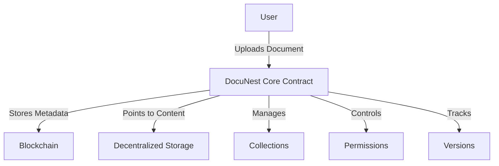

# Heuristic Subgraph: Metadata Registry

A decentralized metadata registry built on the Stacks blockchain for tracking, organizing, and managing complex information networks with advanced access controls.

## Overview

Heuristic Subgraph provides a blockchain-native solution for creating flexible, permission-controlled metadata registries. By storing metadata, access rights, and versioning information on-chain, the system enables robust and transparent information management across distributed systems.

### Key Features
- Create and manage dynamic metadata collections
- Advanced versioning and provenance tracking
- Granular, hierarchical permission systems
- Immutable record keeping
- Decentralized access control
- Extensible registry architecture

### Use Cases
- Decentralized data management
- Cross-platform metadata tracking
- Research and academic record systems
- Collaborative information networks
- Regulatory compliance and audit trails

## Architecture

The system is built around a core smart contract that manages document metadata, collections, and permissions. Here's how it works:



### Core Components
- Document Registry
- Collection Management
- Permission System
- Version Control
- Access Control

## Contract Documentation

### docunest-core.clar

The main contract handling all document management functionality.

#### Permission Levels
- NONE (0): No access
- VIEW (1): Read-only access
- EDIT (2): Can modify documents
- ADMIN (3): Full control

#### Key Data Structures
- `collections`: Stores collection metadata
- `documents`: Stores document metadata
- `collection-documents`: Maps documents to collections
- `document-versions`: Tracks document version history
- `collection-permissions`: Stores collection access rights
- `document-permissions`: Stores document access rights

## Getting Started

### Prerequisites
- Clarinet
- Stacks wallet
- IPFS or Gaia storage setup

### Installation
1. Clone the repository
2. Install dependencies
3. Deploy using Clarinet

```bash
clarinet deploy
```

### Basic Usage

1. Create a collection:
```clarity
(contract-call? .docunest-core create-collection 
    "collection-123" 
    "Family Documents" 
    (some "Important family records"))
```

2. Add a document:
```clarity
(contract-call? .docunest-core add-document
    "doc-456"
    "Will.pdf"
    (some "Last Will and Testament")
    "pdf"
    "ipfs://Qm..."
    0x1234...
    u1000)
```

## Function Reference

### Collection Management
- `create-collection`: Create a new document collection
- `delete-collection`: Remove a collection
- `get-collection`: Retrieve collection details

### Document Management
- `add-document`: Add a new document to the system
- `update-document`: Create a new document version
- `delete-document`: Remove a document
- `get-document`: Retrieve document details
- `get-document-version`: Get specific version information

### Permission Management
- `grant-document-permission`: Set document access rights
- `grant-collection-permission`: Set collection access rights
- `can-view-document`: Check view permissions
- `can-edit-document`: Check edit permissions
- `can-admin-collection`: Check admin permissions

## Development

### Testing
Run the test suite using Clarinet:
```bash
clarinet test
```

### Local Development
1. Start Clarinet console:
```bash
clarinet console
```

2. Deploy contracts:
```clarity
(contract-call? .docunest-core ...)
```

## Security Considerations

### Key Security Features
- Immutable audit trail of all document changes
- Granular permission controls
- Owner-only administrative actions
- Version history tracking

### Best Practices
1. Always verify document hashes after upload
2. Use appropriate permission levels
3. Regularly audit access permissions
4. Keep private keys secure
5. Backup documents in secure locations

### Limitations
- Document content stored off-chain
- Gas costs for frequent updates
- Block size limits for batch operations
- Permission inheritance not implemented